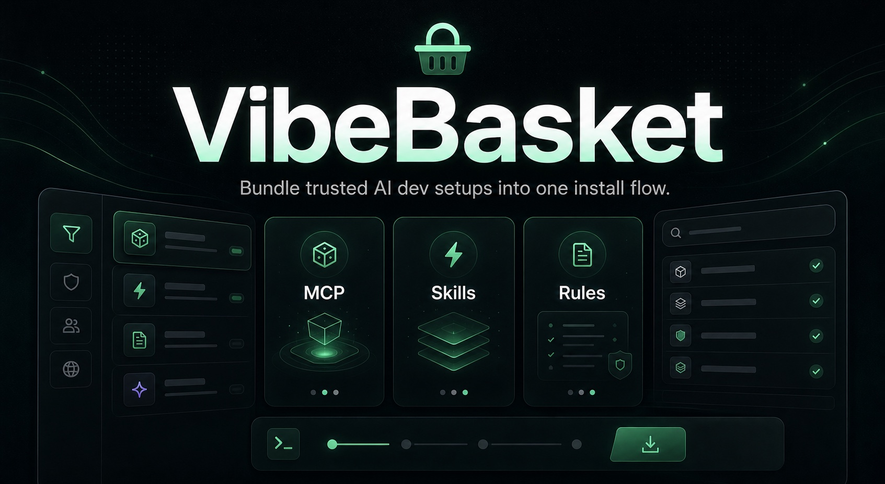

# VibeBasket



Bundle trusted MCP servers, agent skills, and project rules into one shareable install command. Apply across 24 AI IDEs and CLI tools with a single link.

[](package.json)
[](https://www.npmjs.com/package/vibebasket)
[](tsconfig.base.json)
[](https://github.com/mhmtayberk/VibeBasket/actions/workflows/ci.yml)
[](https://github.com/mhmtayberk/VibeBasket/security)
[](LICENSE)

---

## Table of Contents

- [What is VibeBasket?](#what-is-vibebasket)
- [Who It's For](#who-its-for)
- [What It Is Not](#what-it-is-not)
- [Supported Targets](#supported-targets-24-ides--cli-tools)
- [Core Capabilities](#core-capabilities)
- [Quick Start](#quick-start)
- [CLI Usage](#cli-usage)
- [Configuration](#configuration)
- [Self-Hosting](#self-hosting)
- [Architecture](#architecture)
- [Docs Map](#docs-map)
- [Security](#security)
- [License](#license)

## What is VibeBasket?

VibeBasket helps you stop configuring MCP servers, skills, and rules one tool at a time.

Browse a trusted catalog, select what you want, and generate one `npx` command that applies the bundle across the AI IDEs and CLI tools you actually use.

```
npx vibebasket apply https://vibebasket.dev/api/bundle/cj2k9x
```

Start here:

- Hosted app: [vibebasket.dev](https://vibebasket.dev)
- npm package: [npmjs.com/package/vibebasket](https://www.npmjs.com/package/vibebasket)
- Self-host guide: [SELF_HOSTING.md](SELF_HOSTING.md)

## Who It's For

- Standardizing MCP-heavy setups across multiple AI IDEs and terminal tools
- Turning one curated stack into a repeatable install flow for a team or project
- Keeping install behavior idempotent so re-applying a bundle is safe
- Letting self-hosters run the whole stack on a single VPS without adding Redis, Postgres, or extra infra

## What It Is Not

- A hosted secrets manager for end-user runtime credentials
- A multi-node control plane with shared cache/state infrastructure by default
- A universal package manager for arbitrary IDE extensions outside MCPs, Skills, and Rules

## Supported Targets (24 IDEs & CLI tools)

| IDE | MCP | Skills | Rules |
|-----|:---:|:------:|:-----:|
| Cursor | ✅ | ✅ | ✅ |
| Windsurf | ✅ | ✅ | ✅ |
| VS Code / Cline | ✅ | — | — |
| Claude Code | ✅ | ✅ | — |
| GitHub Copilot | — | ✅ | ✅ |
| Continue | ✅ | ✅ | — |
| Roo Code | ✅ | ✅ | ✅ |
| Codex CLI | ✅ | — | — |
| Gemini CLI | ✅ | ✅ | — |
| Antigravity | ✅ | — | — |
| JetBrains Junie | ✅ | — | — |
| Kiro | ✅ | ✅ | — |
| Cline CLI | ✅ | — | — |
| Zed | ✅ | ✅ | — |
| Hermes | ✅ | ✅ | — |
| OpenClaw | ✅ | ✅ | — |
| Void Editor | ✅ | — | — |
| Aider | — | ✅ | ✅ |
| DeepSeek-TUI | ✅ | — | — |
| Cortex Code | ✅ | ✅ | — |
| Goose | ✅ | — | — |
| IBM Bob | ✅ | ✅ | — |
| CodeBuddy | ✅ | ✅ | — |
| OpenCode | ✅ | ✅ | ✅ |

16 supported targets auto-install Skills. 6 supported targets auto-install Rules. All MCP-capable targets auto-install MCP servers.

## Core Capabilities

### Trusted catalog
- Thousands of items when synced from the MCP Registry, the public skills.sh catalog, and curated sources
- Trust tiers: Verified (curated), Official (explicit upstream certification), Community — no heuristic trust scoring
- FTS5 full-text search with prefix matching across display name, description, and source URL
- Filter by type, trust tier, freshness, and sort order

Catalog scope:

- MCP coverage is intentionally bounded by the official MCP Registry plus curated verified overrides
- Skills coverage comes from the public `skills.sh` corpus plus curated verified overrides
- If a popular MCP is not published in the official registry, it will not appear automatically until it is curated or the upstream registry adds it

### Install engine
- One bundle can be applied across 24 supported targets
- Writes are idempotent and backup-aware
- Target capability checks prevent pretending every IDE supports the same surface
- Secrets are resolved locally by the CLI during apply

### CLI
- `apply` — Install bundles from URLs or local files (`--force`, `--scope`, `--dry-run`, `--no-verify`)
- `list` — Scan all 24 IDEs for installed MCPs, skills, and rules
- `search` — Search the catalog from terminal
- `doctor` — Diagnose IDE configurations across all targets
- `init` — Scaffold a VibeBasket project
- `rollback` — Restore from timestamped backups (run from the target project root for project-scoped configs)

### Admin and operations
- Manual catalog sync, backup management, storage config, and release-readiness checks
- FTS health checks, DB integrity checks, and cleanup actions
- User overview and admin allowlist management

### Security model
- End-user runtime secrets never appear in bundle manifests and are prompted locally by the CLI; most targets then store them only in that machine's local IDE config surface
- AES-256-GCM encrypted storage credentials
- Sliding-window rate limiting on 8 API endpoints with Retry-After headers
- CSP and security headers enforced in production
- Path sanitization on all file operations
- 4 optional OAuth providers: GitHub, Google, Apple, Microsoft Entra ID
- GitHub Actions CI, CodeQL, gitleaks, Dependabot, and `NEXT_PUBLIC_*` allowlist enforcement

### Backup and storage
- 6 backends: Local, AWS S3, Cloudflare R2, DigitalOcean Spaces, Azure Blob, GCS
- External-scheduler backups with configurable intervals
- Encrypted credentials stored in SQLite, never in environment files
- Backup restore works across local and supported cloud storage backends

## Quick Start

Choose the path that matches what you are trying to do:

- Just use the hosted product: open [vibebasket.dev](https://vibebasket.dev), build a basket, copy the `npx vibebasket apply ...` command, and run it locally
- Prefer the published CLI package surface: use `npx vibebasket ...` or inspect the package page at [npmjs.com/package/vibebasket](https://www.npmjs.com/package/vibebasket)
- Self-host on one machine: use Docker first
- Hack on the repo: use the manual workspace setup

If you deploy with Coolify, prefer Dockerfile mode. Build Pack mode is also supported via the repo-level `nixpacks.toml`.

### Docker

```bash
git clone https://github.com/mhmtayberk/VibeBasket.git
cd VibeBasket
cp .env.example .env
# fill at least AUTH_SECRET and NEXTAUTH_URL before booting production mode
docker compose up -d
```

After first boot, either wait for the initial catalog bootstrap or run `docker compose exec web node scripts/catalog-sync.mjs`, then verify `/api/catalog/status`.

### Manual

```bash
git clone https://github.com/mhmtayberk/VibeBasket.git
cd VibeBasket
cp .env.example .env
pnpm install
pnpm dev
```

After first boot, either wait for the initial catalog bootstrap or run `pnpm catalog:sync`, then verify `/api/catalog/status`.

Open [http://localhost:3000](http://localhost:3000).

## CLI Usage

The official package name is [`vibebasket`](https://www.npmjs.com/package/vibebasket).

```bash
# Install from bundle URL
npx vibebasket apply https://vibebasket.dev/api/bundle/cj2k9x

# Install from a local bundle file
npx vibebasket apply ./bundle.json

# Options
npx vibebasket apply <url> --scope project --dry-run --force

# List installed configs
npx vibebasket list

# Search catalog
npx vibebasket search postgresql

# Environment check
npx vibebasket doctor

# Scaffold project
npx vibebasket init

# Restore from backup
npx vibebasket rollback
```

Example local bundle file:

```json
{
  "schemaVersion": "0.1",
  "name": "Local example",
  "scope": "user",
  "targets": ["cursor"],
  "mcps": [],
  "skills": [],
  "rules": [],
  "workflowPacks": []
}
```

## Configuration

Most deployments only need a small subset to get started:

| Variable | Required | Description |
|----------|:--------:|-------------|
| `AUTH_SECRET` | Yes | Session and encryption secret. Also used to protect stored backup backend credentials. Generate with `openssl rand -base64 32` |
| `NEXTAUTH_URL` | Yes | Public deployment URL used for OAuth callbacks |
| `AUTH_<PROVIDER>_ENABLED` | No | Enables a provider only when its credentials are also present |
| `AUTH_GITHUB_ID/SECRET` | No | GitHub OAuth credentials |
| `AUTH_GOOGLE_ID/SECRET` | No | Google OAuth credentials |
| `AUTH_APPLE_ID/SECRET` | No | Apple Sign-In credentials |
| `AUTH_MICROSOFT_ENTRA_ID_ID/SECRET` | No | Microsoft Entra ID credentials |
| `ADMIN_OAUTH_EMAILS` | No | Comma-separated verified emails allowed into `/admin` |
| `AUTH_TRUST_HOST` | No | Set to `true` behind a trusted proxy or CDN |
| `TRUST_PROXY` | No | Set to `true` only when forwarded client IP headers are trustworthy |
| `CATALOG_REFRESH_TOKEN` | No | Needed only for authenticated production refresh calls |
| `BACKUP_JOB_TOKEN` | No | Token for external schedulers that call `POST /api/internal/backup` |

See [`.env.example`](.env.example) for the complete environment surface and backup backend variables.

OAuth note: provider buttons appear only when the provider is both enabled and fully configured.

## Self-Hosting

VibeBasket is currently optimized for **single-node deployments**: one app instance, one SQLite database, and no Redis or shared cache by default.

Start here:

- [SELF_HOSTING.md](SELF_HOSTING.md)
- [docs/SETUP.md](docs/SETUP.md)
- [docs/PRODUCTION_READINESS_CHECKLIST.md](docs/PRODUCTION_READINESS_CHECKLIST.md)

Operational notes:

- `/api/health` is safe for container and orchestration health checks
- `/api/catalog/status` exposes catalog freshness and the latest sync result
- `pnpm catalog:sync:strict` is available as a pre-launch validation command
- the main CI gate is `pnpm verify:ci`

## Architecture

Main parts of the repo:

- `packages/core`
  Shared schemas, SQLite bootstrap, and database access
- `packages/adapters`
  24 IDE and CLI adapters with target-specific install logic
- `packages/registry`
  Catalog sync from the official MCP Registry, `skills.sh`, and curated verified data
- `apps/web`
  Next.js web app, APIs, auth flows, saved stacks, and admin surfaces
- `apps/cli`
  Local installer CLI for apply, list, search, doctor, init, and rollback
- `charts/vibebasket`
  Helm chart for single-replica self-hosted deployments

Key patterns:

- idempotent config writes
- immutable bundle URLs
- DB-first configuration for admin-managed settings
- adapter capability checks instead of pretending every target supports the same surface
- FTS5-backed catalog search with persisted sync metadata

For more detail:

- [docs/ARCHITECTURE.md](docs/ARCHITECTURE.md)
- [docs/PROJECT_OVERVIEW.md](docs/PROJECT_OVERVIEW.md)
- [docs/SETUP.md](docs/SETUP.md)

## Docs Map

- [CONTRIBUTING.md](CONTRIBUTING.md)
- [SECURITY.md](SECURITY.md)
- [CODE_OF_CONDUCT.md](CODE_OF_CONDUCT.md)
- [SELF_HOSTING.md](SELF_HOSTING.md)
- [docs/ARCHITECTURE.md](docs/ARCHITECTURE.md)
- [docs/PROJECT_OVERVIEW.md](docs/PROJECT_OVERVIEW.md)
- [docs/SETUP.md](docs/SETUP.md)
- [docs/PRODUCTION_READINESS_CHECKLIST.md](docs/PRODUCTION_READINESS_CHECKLIST.md)

## Security

Repository guardrails:

- CI runs a repo-level secret scan with `gitleaks`.
- Executable and config files are checked for `NEXT_PUBLIC_*` usage, and only reviewed allowlisted names are accepted.

Report vulnerabilities via [GitHub Security Advisories](https://github.com/mhmtayberk/VibeBasket/security/advisories/new). See [SECURITY.md](SECURITY.md) for the full threat model.

## License

MIT
